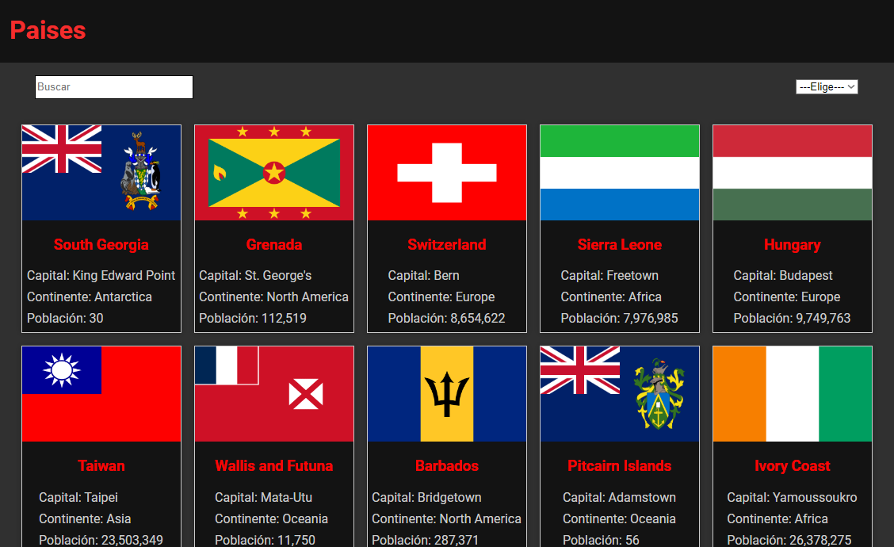

# Página Web de Países

Este proyecto es una aplicación web construida con React que muestra información detallada sobre países de todo el mundo. La información es obtenida de una API pública de países. Los usuarios pueden buscar países por nombre, ver detalles específicos de cada país, y filtrar los países por región.

## Captura de Pantalla



## Características

- **Listado de países:** Muestra una lista de todos los países con información básica.
- **Búsqueda de países:** Permite buscar países por nombre.
- **Detalles del país:** Al seleccionar un país, se muestra información detallada, incluyendo la bandera, capital, población, idioma, y más.

## Instalación

1. **Clonar el repositorio:**

   ```bash
   git clone https://github.com/tu-usuario/nombre-del-repositorio.git

## Tecnologías Utilizadas

- **React:** Biblioteca principal para la construcción de la interfaz de usuario.
- **React Router:** Para la navegación en la aplicación.
- **Axios:** Para realizar solicitudes HTTP a la API pública.